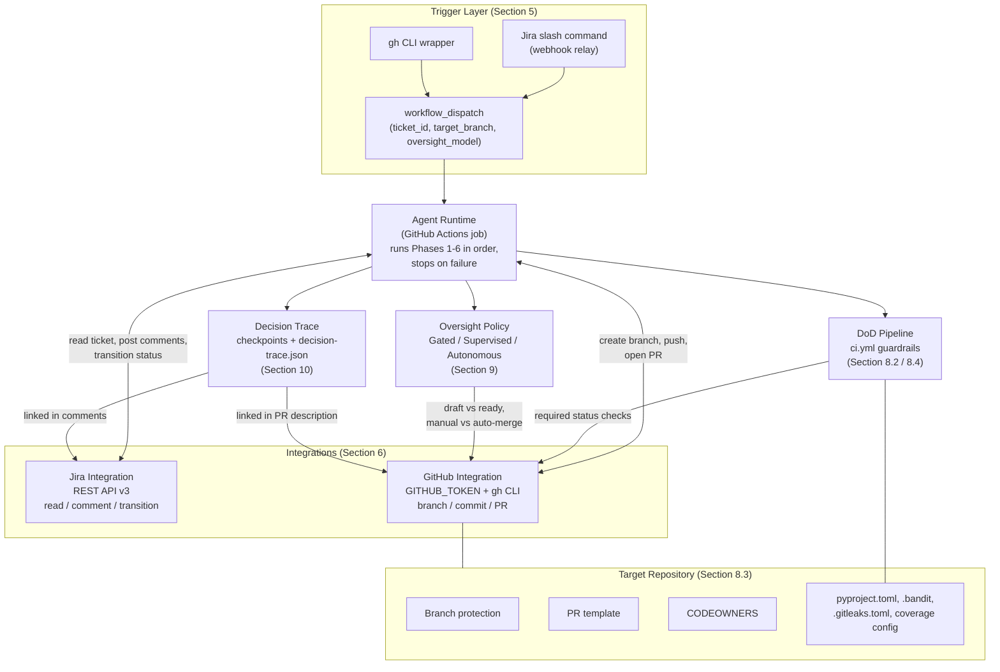

# Design document:  autonomous sde1 agent-   ticket to pull request

## 1. Executive Summary

 This document specifies the design of an  **autonomous SDE1 agent** that takes a Jira/or equivalent ticket, implements the required change in a python Codebase, and raises a production-quality pull request on GitHub - with automated guardrails enforcing a Definition of Done (DoD) before any PR is allowed to progress.

The agent is modeled as a **single agent that executes a fixed, phased workflow** (understand -  plan - implement - self-verify - PR).  It is **triggerd by an explicit user command**, runs on **GitHub Actions**, and is bounded by **quality and security guardrails** (lint, type-check, unit tests, coverage, SAST, dependency and secret scanning) that gate the PR.

Three operating models are preseneted for the human-oversight decision, ordered along the **maturity path or graduation path** teams follow as trust in the agent grows:

- **Gated (recommended default):** agent pauses at explicit checkpoints and requires human approval of the plan (and optionally the code) *before* it proceeds. This is the highest-control model.

- **Supervised:** agent opens a *draft* PR; a human reviews and merges.

- **Autonomous:** agent auto-merges when the pipeline is green, with no human gate.

All models record **decision checkpoints** that trace the agent's reasoning at each phase (refer section 10), so AI decisions are auditable regardless of the chosen model.

Ambiguous or oversized tickets are **rejected with a comment back to ticket** rather than implemented on guesswork.

### 1.1 Why this matters

- **Throughput** Offloads well-scope, low-risk tickets from human engineers
- **Consistency** Every tickets passess the same DoD gates
- **Auditability** The entire ticket to PR trace is captured in GitHub Actions logs, the PR description, and ticket comments.
- **Controlled risk** guradrails and the choise of oversight model let the team dial the autonomy up or down per repo or ticket.

---

## 2. Problem statement
Engineering teams spend a considerable amount of time on small, well-defined tickets - be it bugs, minor features, dependency upgrades etc. We need an agent that behaves like a disciplined **SDE1**: it picks up a ticket only when the ticket is ready, implement it to a defined standard, proves the work meets the DoD through automated checks, and creates a clean PR to a reviewer. Importantly, it must be able to scope the work well - declining tickets that are too large or ambiguous instaead of producing low-quality output.

### 2.1 Goals

- Convert a **ready** ticket into a production-quality PR without human coding.
- Enforce a machine-checkable **Definition of Done** as a hard gate.
- Provide **security guardrails** before PR
- Support **3 models** - (Gated pre-implementation approval, Supervised, and Autonomous) along a maturity path
- Produce a full **audit trail** across the ticket, GitHub, and Actions, including **decision checkpoints** that trace the agent's reasoning at each phase.

### 2.2 What it is not

- Not a multi-agent framework (single phased agent by design)
- Not responsible for ticket refinement. Tickets have to be well defined.
- Not intended for large, cross-cutting, or architecturally ambiguaos work.
- Not a replacement for code review

---

## 3. Terminology

| Term | Meaning |
|------|---------|
| **Agent** | This single automated SDE1 process defined here. |
| **DoD** | Definition of Done - the set of conditions that need to be satisfied in order to consider a ticket done. |
| **Readiness (DoR)** | Definition of Ready - pre-reqs a ticket must meet to be picked up. |
| **Gaurdrail** | An automated check that can block the PR (lint, tests etc.). |
| **Oversight model** | The policy for whether a human must approve/merge. |
| **Command trigger** | An explicit user action that starts a run for a given ticket. |

---

## 4. High-level architecture

All phases emit **decision checkpoints** to a persistent trace (Section 10.2) that records what the agent decided and why.

**Architecture diagram**

Note: Assumes Jira as the requirements system. Works for any tool.

For visualization of the workflow check workflow-diagram.md

### 4.1 Component responsibilities
| Component | Responsibility |
|-----------|----------------|
| **Trigger (workflow_dispatch)** | Accept an explicit user command with ticket ID + target repo/branch; start a run. |
| **Agent runtime** | Execute the 6 phases in order; stop on failure. |
| **Jira integration** | Read ticket fields; post status/clarification comments; transition status. |
| **GitHub integration** | Create branch, commit, push, open PR, link ticket. |
| **DoD pipeline (`ci.yml`)** | Run all guardrails on the PR; report pass/fail as required checks. |
| **Oversight policy** | Decide draft-vs-ready and manual-vs-auto-merge per the Gated, Supervised, or Autonomous model. |

---

## 5. Tigger model - User Command

The agent starts **only on an explicit user command**. Options:

- **Primary:** GitHub Actions `workflow_dispatch` with inputs:
    - `ticket_id` - required
    - `target_branch` (defaulted to repo default branch)
    - `oversight_model` (`gated` | `supervised` | `autonomous`, default `gated`)
- **Convenience wrappers** 
    - slash command in ticket comment (ex /implement) forwarded via a small webhook relay to a dispatch endpoint
    - `gh workflow run agent-run.yml -f jira_id=PROJ-123` from CLI.

Note: `workflow_dispatch` keeps the trigger explicit and auditable (who dispatched, when) while allowing other front-ends without changing the core.
---

## 6. Integration approach (recommended)

Jira and GitHub integration should use a **hybrid approach**:

- **GitHub:** use the **built-in `GITHUB_TOKEN`** and the `gh` CLI / REST API from within the Action for branch, commit, and PR operations. No extra credentials required for same-repo work.
- **Jira:** use the **JIRA Cloud REST API v3** with a scoped **API token stored as a GitHub Actions secret** (`JIRA_BASE_URL`, `JIRA_EMAIL`, `JIRA_API_TOKEN`). Wrap read, comment (add clarification/status), and transition in a thin Python client.

**Design decision: Why REST over webhooks/MCP**
The trigger is a user command, not an event, so webhooks are unnecessary for initiation. Direct REST keeps the dependency surface small, runs entirely inside the Action, and is straitforward to secret-manage and audit. An MCP-based tool layer is noted as a **future-option** if the agent needs a model-driven tool use. It is out of scope for v1.

**Least privilege** the Jira token should have only read + comment + transition scopes on the relevant project. The GitHub token should be scoped to the target repository.

---

## 7. The Phased Agent Workflow

The agent is a **single agent** that runs a **fixed, sequential pipeline**. Each phase has an explicit exit gate; failure to pass a gate stops the run and reports back.

### Phase 1 - Understand
- Fetch the ticket - summary, description, acceptance criteria, labels, linked issues, attachements.
- Normalize into a structured internal ticket model

### Phase 2 - Readiness (DoR gate)
- Evaluate the ticket against the **Definition of Ready** (Section 8).
- If not ready, post a clarification comment to Jira listing what is missing, transition the ticket (ex: `Needs Info`), and **stop**. This is the reject and comment behaviour.

### Phase 3 - Plan
- Produce a concrete task breakdown: files to change, tests to add, egdge cases.
- **Emit a decision checkpoint** capturing the interprested requirements, the chosen approach, alternatives considered, and assumptions (section 10.2),
- Record the plan in the run log and (in the Supervised mode) in the eventual PR description.
- **Gated - plan approval gate:** post the plan to Jira/GitHub and **pause**, awaiting explicit human approval before any code is written. On rejection, incorporate feedback and re-request approval, or stop if declined.

### Phase 4 - Implement
- Create a working branch `agent\TICKET-ID-short-title`.
- Make focused code changes following repo conventions.
- Add/adjust unit tests to cover the change and its acceptance criteria. Always review the tests and use property based tests as much as possible
- **Emit decision checkpoints** for implementation choices
- **Gated - code approval gate (optional):** after implementation and before opening a non-draft PR / merging, **pause** for human approval of the diff. On rejection, revise and re-request.

### Phase 5 - Self-verify (local DoD dry run)
- Run full DoD guardrail suite locally **before** opening the PR. (Local CI or in the branch).
- **Emit a decision checkpoint** summarizing guardrail results and any correction attempts.
- If any cgeck fails, attempt bounded self-corrections (max N iterations); if still failing, open a draft PR with failure summary (Gated/Supervised) or **abort and comment** (Autonomous)

### Phase 6 - Raise PR
- Push the branch and open a PR that:
    - Links the ticket (title prefix `PRO-123:`).
    - Uses the repo PR template (if present) and includes plan, changes, and DoD status.
    - Adds the `co-authored-by: <the used model>` trailer.
    - Includes a link to or summary of the **decision trace** for reviewer visibility.
- Apply the oversight model (Section 9): proceed as Supervised (draft PR for review) or Autonomous (auto-merge on Green) - in the Dated model, only after the approval gate(s) passed.
- Transition the ticket (ex: `In Review`).

---

## 8. Prerequisites and Guardrails

These are the **pre-requistes the repository must have in place** for the agent to function safely. They are the guardrails that make the agent output trustworthy.

### 8.1 Definition of Ready (DoR) - ticket-level pre-req

A ticket is picked up **only if** it has:

- A clear, unambiguaous summary and description.
- Explicit, testable **acceptance criteria**.
- Scope small enough for an SDE1-sized change (single logical concern, bounded number of files, no cross-service/architectural changes).
- No unresolved open questions or blocking dependencies.

If any are missing - **reject and comment** (Phase 2). 

> A copy-ready checklist is provided in
> [`agent-config/definition-of-ready.md`] (../agent-config/definition-of-ready.md).

### 8.2 Definition of Done (DoD) 

A ticket is considered as **changes done** only when **all** of the following pass in CI:

1. **Lint** - clean
2. **Formatting** check clean
3. **Type check** clean on changed code
4. **Unit Tests** all passing
5. **Coverage threshold** >= configured minimum. Overall coverage must not regress.
6. **Security - SAST** Python static analysis with no high-severity findings.
7. **Security - Dependencies** `pip-audit` with no unresolved high/critical`.
8. **Security - secrets** `gitleaks` / `detect-secrets` finds no committed secrets.
9. **PR hygiene** links the ticket, follows the PR template, focused diff.

> A ready checklist is provided for reference in
>  [`agent-config/definition-of-done.md`] (../agent-config/definition-of-done.md).

### 8.3 Pipeline pre-reqs (repo setup)

For the guardrails to be enforceable, the repo must have:

- **`ci.yml`** GitHub Actions workflow running all DoD checks on every PR, exposed as **required status checks**.
- **`agent-run.yml`** Workflow implementing the `workflow_dispatch` trigger and the phased agent.
- **`Branch protection`** on the default branch requiring the `ci.yml` checks to pass before merge.
- **`Project config`** for the tools: `pyproject.toml`, coverage config, and `.gitleaks.toml`, `.bandit` as needed.
- **Secrets** configured in the repo/org (if using Jira): `JIRA_BASE_URL`, `JIRA_EMAIL`, `JIRA_API_TOKEN`.
- **PR template** (`.github/pull_request_template.md`) so agent PRs are consistent.
- **CODEOWNERS** To route reviews.

### 8.4 Guardrail summary table

| # | Guardrail | Tool (suggested) | Phase enforced | Blocking? | Config source |
|---|-----------|-------------------|----------------|-----------|----------------|
| 1 | Lint | `ruff` | 5 (self-verify), CI | Yes | `pyproject.toml` |
| 2 | Formatting | `ruff format` / `black` | 5, CI | Yes | `pyproject.toml` |
| 3 | Type check | `mypy` (or `pyright`) | 5, CI | Yes | `pyproject.toml` |
| 4 | Unit tests | `pytest` | 5, CI | Yes | `pyproject.toml` / `pytest.ini` |
| 5 | Coverage threshold | `pytest-cov` / `coverage.py` | 5, CI | Yes | `pyproject.toml` (`[tool.coverage]`) |
| 6 | SAST | `bandit` | 5, CI | Yes (high-severity) | `.bandit` |
| 7 | Dependency scanning | `pip-audit` | 5, CI | Yes (high/critical) | N/A (advisory DB) |
| 8 | Secret scanning | `gitleaks` / `detect-secrets` | 5, CI | Yes | `.gitleaks.toml` |
| 9 | PR hygiene | template + ticket link check | 6, CI | Yes | `.github/pull_request_template.md` |

Notes:
- **Phase 5 vs CI** - the same checks run twice: once locally in the agent's branch during self-verify (so the agent can self-correct before opening a PR), and again in `ci.yml` as the authoritative, required status check. The agent's local run is a rehearsal; CI is the gate that actually blocks merge.
- **Blocking** means the check must pass before the PR can merge (Supervised/Gated: before a human can merge; Autonomous: before auto-merge fires). None of these checks are advisory-only in v1.
- Coverage regression is evaluated against the target branch's baseline, not an absolute number alone, so the agent cannot satisfy the threshold by adding low-value tests elsewhere while lowering coverage on the changed files.

---

## 9. Human Oversight - 3 models for consideration

The three models differ only in **where the human gate sits**, not in what the agent does. All three run the same six phases, produce the same decision trace, and are subject to the same DoD gate in CI. The `oversight_model` input (Section 5) selects the model per run; it can also be pinned per repository (e.g. via a repo-level default in `agent-run.yml`) so that lower-trust repos cannot be run in Autonomous mode. The models are listed in **garduation-path order**.

### 9.1 Gated (recommended default)

- **Plan approval gate (mandatory):** after Phase 3, the agent posts the plan (approach, files, tests, assumptions) to Jira and/or as a PR-less comment/issue, and **pauses**. No code is written until a human explicitly approves.
- **Code approval gate (optional, configurable):** after Phase 4, the agent can pause again for human review of the diff before Phase 6 opens a non-draft PR.
- **Raising a PR *is* part of this model.** Gated does not replace PR step - it adds human approval gates(s) *in front of it*. 
- Approval mechanism: a human replies/approves on the Jira ticket or a GitHub comment/environment-protection gate; the workflow resumes on approval and stops on rejection.
- On rejection at either gate, the agent incorporates the feedback and re-submits for approval, up to a bounded number of rounds; if still declined, it stops and comments back to Jira.
- **Pros:** catches misunderstanding *before* any effort is spent; highest-control.
- **Cons:** slowest cycle time.
- **When to use:** new repos, unfamiliar codebases, higher-risk tickets, or while the team is still building trust in the agent's judgement.

### 9.2 Supervised

- No pre-implementation approval gate. The agent runs Phases 1-5 autonomously and opens a **draft PR** in Phase 6.
- A human reviews the draft PR as they would any teammate's PR, and merges it once satisfied (CI must still be green).
- Decision checkpoints and the plan are included in the PR description so the reviewer has the same context a Gated approver would have seen - the review just happens after the code exists rather than before.
- **Pros:** senior judgment on correctness; safest for higher-risk tasks.
- **Cons:** human throughput remain a bottleneck.
- **When to use:** the default "steady state" once a team trusts the agent's planning but still wants a human in the merge path.

### 9.3 Autonomous

- No human gate at any phase. If Phase 5 self-verify and the CI-run DoD checks are green, the agent **auto-merges** the PR in Phase 6.
- If any DoD check fails and bounded self-correction (Phase 5) doesn't resolve it, the agent **aborts and comments** back to Jira rather than opening a PR - it never merges on a red or unresolved pipeline.
- Decision checkpoints are still emitted and retained for audit, even though no human consumes them synchronously.
- **Pros:** maximal throughput; zero human latency on well-scoped tickets.
- **Cons:** relies entirely on guardrail coverage; a gap in checks will surface as a safety issue.
- **When to use:** narrow, well-understood ticket categories (e.g. routine dependency bumps, well-scoped bug fixes) in repos with a mature, trusted DoD pipeline. Recommended only after a period of running Supervised with a low correction/rejection rate.

### Maturity / graduation path

Teams are expected to move Gated -> Supervised -> Autonomous as confidence grows, using the decision trace and PR outcomes as the evidence base for graduating a repo or ticket category to the next model. Regression is expected and fine: a repo can be moved back to a more conservative model at any time, and nothing prevents mixing models across repos or ticket types simultaneously.

| Model | Pre-code human gate | Post-code human gate | Merge | Best fit |
|-------|---------------------|-----------------------|-------|----------|
| Gated | Required (plan) | Optional (diff) | Human, after gates pass | New/unfamiliar repos, higher-risk work |
| Supervised | None | Required (PR review) | Human | Default steady state |
| Autonomous | None | None | Auto, on green | Narrow, proven, low-risk ticket categories |

### 9.5 Model comparison

| Dimension | Gated | Supervised | Autonomous |
|-----------|-------|------------|------------|
| **Pre-code human gate** | Required (plan approval) | None | None |
| **Post-code human gate** | Optional (diff approval) | Required (PR review before merge) | None |
| **Where the human touches the work** | Before any code is written, and optionally before merge | After code exists, at PR review | Not synchronously - only if something goes wrong |
| **Merge mechanism** | Human, after gate(s) pass | Human, after reviewing the draft PR | Automatic, on green CI |
| **Latency (ticket -> merged)** | Slowest - blocked on human availability at 1-2 points | Medium - blocked on one PR review | Fastest - no blocking wait if pipeline is green |
| **Human effort per ticket** | Highest - reviews plan (and optionally diff) | Medium - reviews finished PR, same as a normal review | Lowest - none, unless a failure/abort needs triage |
| **Risk exposure if the agent is wrong** | Lowest - bad plans are caught before code is written | Medium - bad code can reach a draft PR, but never merges unreviewed | Highest - a plausible-but-wrong change can merge if it passes all guardrails |
| **Dependence on DoD guardrail quality** | Lower - human judgement is still a backstop | Medium - human judgement backstops what guardrails miss | Highest - guardrails are the *only* backstop, so they must be trustworthy |
| **Failure handling (Phase 5 unresolved)** | Draft PR opened with failure summary for a human to pick up | Draft PR opened with failure summary for a human to pick up | Abort and comment to Jira - never opens a PR on an unresolved failure |
| **Auditability** | Full decision trace, plus recorded human approvals/rejections at each gate | Full decision trace, reviewed at PR time | Full decision trace, but consumed after the fact (post-merge or on abort) |
| **Rollback if something slips through** | Rare - caught pre-merge in most cases | Rare - caught at PR review | Relies entirely on normal post-merge incident process; strongest signal to move ticket category back to Supervised |
| **Good fit for** | New/unfamiliar repos, higher-risk or first-time ticket categories, building initial trust | Default steady state once planning is trusted; most teams should live here day to day | Narrow, proven, low-risk ticket categories (e.g. dependency bumps) in repos with a mature DoD pipeline |
| **Prerequisite to adopt** | None - this is the starting model | Track record of low plan-rejection rate in Gated | Track record of low correction/rejection rate in Supervised, over an agreed observation period |

---

## 10. Decision Tracing and checkpoints

### 10.1 Purpose

The decision trace is what makes the agent auditable regardless of oversight model (Section 9). It exists so that a reviewer, a Jira stakeholder, or a future incident investigation can answer, without re-running the agent: *what did it decide, at which phase, on what basis, and what did it consider and reject?* Every phase in Section 7 emits at least one checkpoint; Phases 3, 4, and 5 are called out explicitly because that's where interpretation, implementation choices, and self-correction happen.

### 10.2 Checkpoint contents

Each decision checkpoint is a structured record containing:

- **`checkpoint_id`** and **`phase`** (e.g., `plan`, `implement`).
- **`timestamp`** and **`run_id`** +  `jira_id` - correlates the checkpoint to a specific agent run and ticket.
- `phase` - which of the six phases emitted it.
- `oversight_model` in effect for the run.
- `decision` - a short statement of what was decided (e.g. "chosen approach: extend `PaymentValidator` rather than introduce a new class").
- `rationale` - why, in terms of the ticket's acceptance criteria and repo conventions.
- `alternatives_considered` - options that were weighed and not chosen, and why.
- `assumptions` - anything the agent assumed in the absence of explicit ticket detail (kept deliberately minimal per Section 8.1 - a ticket that requires many assumptions should have failed the DoR gate).
- `inputs_referenced` - ticket fields, files, or prior checkpoints the decision drew on.
- `outcome`, where applicable (e.g. guardrail pass/fail counts in Phase 5, approval/rejection in a Gated gate).

> A machine-readable schema is provided in
> agent-config\decision-trace.schema.json ,
> with an example in
> agent-config\decision-trace.example.jsonl

### 10.3 Storage and surfacing

- **Primary store:** checkpoints are written as structured (JSON) log entries as part of the GitHub Actions run log, so they inherit the org's existing log retention.
- **Durable copy:** the full checkpoint set is also serialized to a single artifact (e.g. `decision-trace.json`) uploaded as a GitHub Actions build artifact and linked from the PR description, so the trace survives independent of log retention windows.
- **Human-facing surfacing:**
  - The **Plan checkpoint** (Phase 3) is posted to Jira as a comment at the Gated plan-approval gate, and/or included in the PR description for Supervised/Autonomous runs.
  - The **PR description** (Phase 6) includes a condensed, human-readable summary of the trace plus a link to the full `decision-trace.json` artifact.
  - Jira transitions (Phase 2 rejection, Phase 6 `In Review`) carry a short comment referencing the relevant checkpoint(s).
- **Retention:** the trace for a run is retained at least as long as the corresponding PR and Jira ticket are queryable, so a post-hoc review of a merged agent PR can always be traced back to the reasoning that produced it.

---

## 11. Error Handling and Edge Cases

General principle: **fail closed, comment loudly, never guess.** Any failure mode below stops the run at the point of failure (Section 4.1, Agent runtime: "stop on failure") rather than pushing partial or unverified work forward.

| # | Scenario | Handling |
|---|----------|----------|
| 1 | Ticket fails DoR (Section 8.1) | Reject and comment on Jira with the specific missing items; transition to `Needs Info`; stop (Phase 2). |
| 2 | Ticket is ready but scope is discovered mid-implementation to be larger than expected | Stop Phase 4, emit a decision checkpoint explaining the scope discovery, and comment back to Jira recommending the ticket be split, rather than continuing to a low-quality or partial PR. |
| 3 | Jira ticket updated/edited after the run starts | Run continues against the ticket snapshot taken at Phase 1; a note is added to the PR description that the ticket may have changed since the run started, so reviewers know to re-check. |
| 4 | Gated plan approval rejected | Agent incorporates feedback, re-plans, and re-requests approval, up to a configured max number of rounds; if still rejected, stop and comment on Jira. |
| 5 | Gated code approval rejected | Same pattern as #4, applied to the diff instead of the plan. |
| 6 | DoD guardrail fails during Phase 5 self-verify | Attempt bounded self-correction (max N iterations, Section 7 Phase 5). If still failing: Gated/Supervised -> open a draft PR with a clear failure summary and the decision trace for a human to pick up; Autonomous -> abort, do not open a PR, comment failure details to Jira. |
| 7 | DoD guardrail fails in CI after the PR is open (e.g. flaky test, environment drift) | The PR remains blocked by the required status check; Gated/Supervised leave it for human triage; Autonomous does not auto-merge and the run is flagged for follow-up. |
| 8 | Merge conflict with target branch (base branch moved on) | Agent rebases/updates the branch once, in-scope, and re-runs guardrails; if conflicts persist or touch files outside the original change set, stop and flag for human resolution rather than resolving unrelated conflicts unsupervised. |
| 9 | Jira or GitHub API unavailable/rate-limited mid-run | Retry with backoff for transient errors; if the integration remains unavailable beyond a timeout, stop the run, and (if GitHub is reachable) leave a run-log record; do not silently continue without the ability to report status back. |
| 10 | Secrets/credentials scoped incorrectly or missing (Section 6) | Fail fast at the start of the run (pre-flight credential check) rather than partway through implementation. |
| 11 | Agent produces code that passes all guardrails but is judged low quality by a human reviewer (Supervised) | This is an expected outcome, not a defect: Supervised exists precisely to catch what the DoD can't machine-check. Feedback is captured as a rejection/change-request on the PR; repeated occurrences for a ticket category are a signal the category isn't ready for Autonomous. |
| 12 | Ticket references a linked issue, attachment, or dependency the agent cannot resolve (e.g. private attachment, cross-project link without access) | Treated as a DoR failure (missing/blocked dependency, Section 8.1) - reject and comment rather than proceeding on an incomplete picture. |
| 13 | Duplicate/concurrent runs triggered for the same ticket | Agent runtime checks for an existing open branch/PR or in-progress run for the `ticket_id` before starting; if found, stop and comment rather than creating conflicting branches. |
| 14 | Autonomous run auto-merges and a regression surfaces later | Out of scope for the agent itself to detect post-merge, but the decision trace (Section 10) and PR history provide the audit trail needed for a human-led rollback/incident process; this is a strong signal to move that ticket category back to Supervised. |

---

## 12. Security and Compliance

### 12.1 Credential and secret management

- All credentials live in GitHub Actions **secrets** (repo or org level), never in code, config files, or the decision trace: `JIRA_BASE_URL`, `JIRA_EMAIL`, `JIRA_API_TOKEN` (Section 6), plus the built-in `GITHUB_TOKEN`.
- **Least privilege** (Section 6): the Jira token is scoped to read + comment + transition on the relevant project only; the GitHub token is scoped to the target repository only. Neither is a broad/admin credential.
- Secret scanning (`gitleaks`/`detect-secrets`, Section 8.2 #8) runs on every agent-produced diff before it can merge, protecting against the agent accidentally committing a credential it had access to during the run.
- Tokens are rotated on the org's standard secret-rotation schedule; because the agent doesn't manage its own credentials outside GitHub Actions secrets, rotation requires no agent-side change.

### 12.2 Data handling

- Ticket content (summary, description, acceptance criteria, attachments) is read into the run only for the duration of that run and is not persisted anywhere beyond the run log, the PR, and the decision-trace artifact (Section 10.3) - all of which already sit within the org's existing GitHub/Jira access controls.
- No ticket or code content is sent to any destination outside the configured Jira instance and the target GitHub repository/Action environment.
- If the underlying model provider is called out-of-band (e.g. for planning/implementation), the same data-handling and retention posture the org has already approved for AI-assisted development applies; this design doc does not introduce a new data flow beyond "ticket + repo context in, plan/code/trace out."

### 12.3 Change-control and compliance

- Every merged change is traceable end-to-end: Jira ticket -> decision trace -> PR -> CI run -> merge commit, satisfying standard change-management/audit requirements without additional tooling.
- The **Command trigger** model (Section 5) means every run has an identifiable human initiator (who dispatched, when), even in Autonomous mode - the agent never self-triggers.
- Branch protection and required status checks (Section 8.3) mean the DoD gate is enforced by GitHub itself, not by agent self-reporting - an agent cannot merge a PR that hasn't actually passed CI, regardless of oversight model.
- CODEOWNERS (Section 8.3) ensures agent PRs route to the same review ownership as human-authored PRs, so compliance/ownership rules aren't bypassed for agent-generated changes.
- Because the agent only operates within the target repository's existing permissions, it inherits - rather than expands - that repository's existing compliance posture (e.g. SOC 2/ISO controls the org already applies to its GitHub/Jira estate).

### 12.4 Blast-radius limits

- Scope is bounded at the DoR gate (Section 8.1): single logical concern, bounded file count, no cross-service/architectural changes. This is a security control as much as a quality one - it limits how much an unsupervised (Autonomous) run can change in one pass.
- The agent works on a dedicated branch (`agent/Ticket-ID-short-title`) and never pushes directly to the default/protected branch.
- Autonomous mode's auto-merge is still gated by the full DoD suite including SAST, dependency, and secret scanning (Section 8.2) - there is no "fast path" that skips security guardrails at higher trust levels; only the human-approval step is removed.

---

## 13. Implementation Roadmap (for the build phase)

The rollout follows the same "prove it, then loosen the gate" philosophy as the oversight models themselves (Section 9): ship the guardrails first, then the agent, then graduate autonomy per repo.

### Milestone 0 - Repo readiness (prerequisite, no agent code yet)
- Stand up `ci.yml` with all Section 8.2 DoD checks as required status checks.
- Configure branch protection, `pyproject.toml`, `.bandit`, `.gitleaks.toml`, PR template, CODEOWNERS (Section 8.3).
- Publish `agent-config/definition-of-ready.md` and `agent-config/definition-of-done.md` and get team sign-off.
- **Exit criteria:** a human-authored PR can be merged today only by passing every DoD check; this is validated before any agent code is written.

### Milestone 1 - Phases 1-3 (Understand, Readiness, Plan) in Gated mode only
- Build the Jira/your project requirements client (read/comment/transition), the DoR evaluator (Phase 2), and the planning phase (Phase 3) with decision-checkpoint emission (Section 10).
- No code-writing yet - validate on real tickets that DoR rejection and plan quality are trustworthy before letting the agent touch the codebase.
- **Exit criteria:** plans produced for a sample of real tickets are judged usable by the team without edits, and DoR rejections are judged correct (no false rejects/accepts).

### Milestone 2 - Phases 4-6 (Implement, Self-verify, Raise PR), Gated mode end-to-end
- Add branch creation, implementation, local guardrail self-verify with bounded self-correction, and PR creation with the decision-trace artifact linked.
- Run exclusively in Gated mode (both plan and code approval gates on) against a small, low-risk set of pilot tickets.
- **Exit criteria:** a run of pilot tickets produces PRs that pass CI on first or second attempt and require normal-scale (not extensive) human rework.

### Milestone 3 - Supervised mode pilot
- Turn off the pre-implementation gates for a defined ticket category/repo; agent opens draft PRs directly.
- Track rejection rate, correction iterations, and reviewer feedback as the graduation evidence base (Section 9.4).
- **Exit criteria:** sustained low rejection/correction rate over an agreed observation period.

### Milestone 4 - Autonomous mode, narrow scope
- Enable auto-merge-on-green for a narrow, proven ticket category (e.g. routine dependency bumps) in a repo with a mature DoD pipeline.
- Add any additional monitoring/alerting the team wants around auto-merges (e.g. a digest of what merged autonomously).
- **Exit criteria:** no security-relevant regressions attributable to autonomous runs over an agreed observation period; expand ticket categories/repos incrementally from there.

### Cross-cutting, ongoing
- Convenience triggers (Jira slash command, CLI wrapper - Section 5) can be added at any milestone once the core `workflow_dispatch` path is stable; they are front-ends, not blockers.
- The MCP-based tool layer noted in Section 6 as a future option remains explicitly out of scope for this roadmap and would be scoped separately if a model-driven tool-use need emerges.
